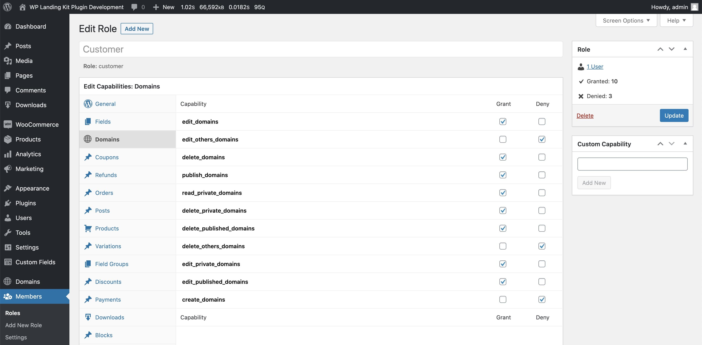

# Controlling edit access for domains

As of version 1.2, access to the **Domains** area of the WordPress admin is restricted to users/roles with a custom set
of capabilities. The capabilities are as follows:

- `edit_domain`
- `read_domain`
- `delete_domain`
- `create_domains`
- `edit_domains`
- `edit_others_domains`
- `delete_domains`
- `publish_domains`
- `read_private_domains`
- `delete_private_domains`
- `delete_published_domains`
- `delete_others_domains`
- `edit_private_domains`
- `edit_published_domains`

The capabilities are all set for _administrators_ by default. If other user roles need access to domains, this needs be
configured either via PHP or via a plugin such as the [Members – Membership & User Role Editor Plugin](https://wordpress.org/plugins/members/).

Consider the following set of capabilities:

With these capabilities, a customer would be able to:

- Edit domains where they are marked as the author (the plugin uses the WordPress author field to indicate the domain owner.)
- Publish their own domains.

The customer would be able to see all domains on site but WordPress won't allow them to edit any domains that aren't
explicitly theirs. They are also unable to create new domains.